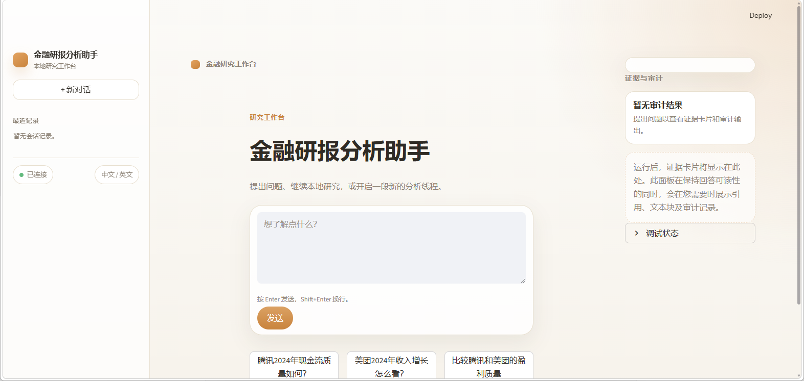

# 金融研报分析与多跳推理 Agent

一个基于模块化 RAG + Agent 架构构建的金融分析与多跳推理智能体系统。

<p align="center">
  
</p>

---

# 功能特性

## 多源金融数据接入（Financial Data Ingestion）

支持异构金融文档解析与接入：

* TXT
* Markdown
* PDF
* CSV
* 图片占位（预留 OCR 能力）

---

## 高级 RAG 检索增强流水线

集成多种检索与推理策略：

* 结构化切分（Structural Chunking）
* 语义切分（Semantic Chunking）
* Query Rewrite
* HyDE 假设文档生成
* 子问题拆解（Sub-query Decomposition）
* BM25 稀疏检索
* 向量检索（Dense Retrieval）
* 本地 Rerank 重排序
* Hybrid RAG 混合检索编排

---

## 基于证据的金融分析（Evidence-Grounded Analysis）

所有金融结论都必须绑定结构化 `EvidenceCard` 证据对象。

每条证据均保留：

* `source_file`
* `page_number`
* `chunk_id`

当证据不足时，系统会拒绝生成无法溯源的金融结论，从而降低幻觉风险。

---

## 基于 LangGraph 的 Agent 工作流

系统采用多节点 Agent 架构设计，包括：

* Analyst 分析节点
* Critic / 合规审查节点
* Citation Guard 引用校验
* Memory Manager 记忆管理
* Retrieval Planner 检索规划器

支持：

* LangGraph 状态机工作流执行
* 依赖缺失时的本地顺序降级执行

---

# 记忆系统（Memory System）

系统同时包含：

## 短期记忆（Short-Term Memory）

维护会话级上下文状态。

---

## 长期记忆（Long-Term Memory）

持久化保存用户画像与偏好信息。

---

## Heartbeat 摘要机制

定期压缩与总结历史上下文，降低长上下文推理成本。

---

# GraphRAG 原型支持

当前已实现 GraphRAG 雏形能力：

* 实体抽取（Entity Extraction）
* 关系抽取（Relation Extraction）
* 邻居检索（Neighbor Retrieval）
* 图增强推理（Graph-Enhanced Reasoning）

---

# 快速开始

## CLI 命令行模式

即使未安装 Streamlit 或 LangGraph UI 依赖，也可以先通过 CLI 验证 Agent：

```bash
python app.py "示例科技2024年的现金流质量如何？"
```

---

## Web 工作台模式

安装依赖：

```bash
pip install -r requirements.txt
```

启动 Streamlit Web 界面：

```bash
streamlit run app.py
```

---

# 构建检索索引

运行数据 ingestion 流水线：

```bash
python -m ingestion.pipeline
```

该命令会生成：

```text
data/processed/chunks.jsonl
```

用于审计与追踪的中间 Chunk 产物。

以及：

```text
data/indexes/chroma_db/
```

用于向量检索的 Chroma 持久化向量数据库。

---

## 仅重建向量库

```bash
python -m rag.vector_store
```

---

# 金融数据集层（Financial Dataset Layer）

项目内置真实金融数据集目录：

```text
data/raw/financial_reports/
```

当前覆盖公司包括：

* 腾讯（Tencent）
* 阿里巴巴（Alibaba）
* 百度（Baidu）
* 快手（Kuaishou）

数据集重点聚焦：

* 中国互联网平台企业
* AI 公司
* 云计算基础设施
* SaaS 软件企业

元数据通过以下文件统一管理：

```text
company_registry.csv
document_registry.csv
```

---

# 数据集工具

## 校验数据集

```bash
python scripts/validate_financial_dataset.py
```

---

## 下载 SEC 文件

首先配置 SEC User-Agent。

### Linux / macOS

```bash
export SEC_USER_AGENT="Your Name your_email@example.com"
```

### Windows PowerShell

```powershell
$env:SEC_USER_AGENT="Your Name your_email@example.com"
```

然后执行：

```bash
python scripts/collect_sec_filings.py
```

---

# 项目结构

```text
.
├── app.py
├── ingestion/
├── rag/
├── agent/
├── memory/
├── graph/
├── scripts/
├── data/
│   ├── raw/
│   ├── processed/
│   └── indexes/
├── docs/
└── requirements.txt
```

---

# 核心设计原则

## Evidence First（证据优先）

所有金融指标与分析结论必须能够追溯到原始证据。

---

## Citation Safety（引用安全）

系统包含 Citation Guard 机制，用于避免生成缺乏证据支撑的幻觉性结论。

---

## Modular Agent Architecture（模块化 Agent 架构）

每种推理能力均被拆分为独立可组合节点，便于扩展与维护。

---

# 后续规划（Roadmap）

* OCR 文档解析集成
* 完整版 GraphRAG
* 金融时序分析工具
* Multi-Agent Debate 多智能体辩论
* 投资组合推理（Portfolio Reasoning）
* 财报电话会议分析
* SEC 文件自动同步
* 量化因子抽取

---

# 文档说明

详细数据集说明见：

```text
docs/financial_dataset_v0.md
```

---

# License

MIT License
